# Strategy Game Tile Tutorial

## Live Demo

#Introduction

In this tutorial we'll be using Smithy to procedurally generate swampland tiles for a strategy game.

If you haven't yet, I recommend checking out the [Quick Start Tutorial](#./quick_start) first. This tutorial builds off of some of the basics covered in the quick start.

#Overview

## In this Tutorial

  We will...

- Add multiple nodes and sockets to objects
- Customize the generation probability of plug objects
- Use jitter controls to create greater output variation
- Use node transform controls for refining plug object position, rotation, and scale
- Create a basic runtime interface
- Use built-in Unity functions to pull usable information from our GameObjects

## Objectives

- We want every generated tile to maintain a consistent visual style, but all generated tiles should look different.
- We want a portion of the tiles to generate with ancient ruins.
- The ruins, too, should be consistent but unique.
- We want our game to easily recognize if the swamp tile contains ruins or not.

## Approach

  Smithy is unlike any built-in Unity tool, and requires a slightly different perspective on asset creation and management,
  especially if Smithy is your first foray into procedural generation. We'll save ourselves a lot of time and effort with just a little planning.

  An intuitive way to think about how Smithy handles assets is Lego, but backwards. If you buy a set, Lego supplies the pieces and the instructions.
  Here, you supply the pieces and the instructions, and Smithy builds your set. Which is a roundabout way of saying that we have to consider *how* assets will first
  together.

  In a real project you might start from a piece of concept artwork or artist's model, but because this is just a tutorial I've made a mockup from the [actual assets we'll be using](#):

  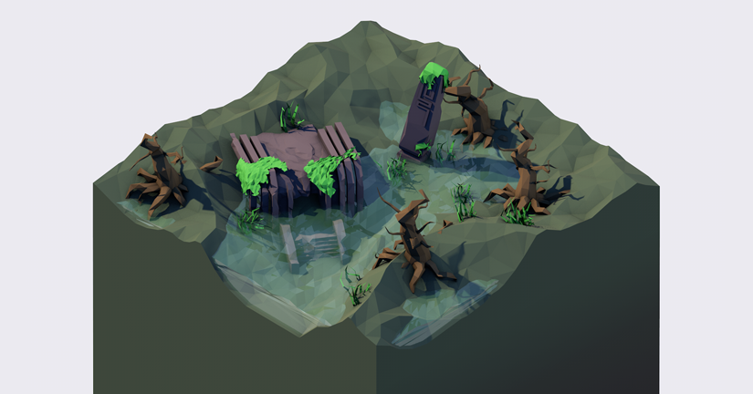

  This is the kind of thing we're going for - swampy, half-submerged ruins. If we can consistently produce tiles like this, we'll consider our work a success. We just have to figure out
  the best way to connect everything together. Smithy uses [Nodes](../editor/node) that [automatically align and arrange their parent transforms](../editor/node#connection-vector). We define [sockets](../editor/node#socket), into which connect [plugs](../editor/node#plug). Let's explode this mockup to get a better idea of how our pieces connect together:

  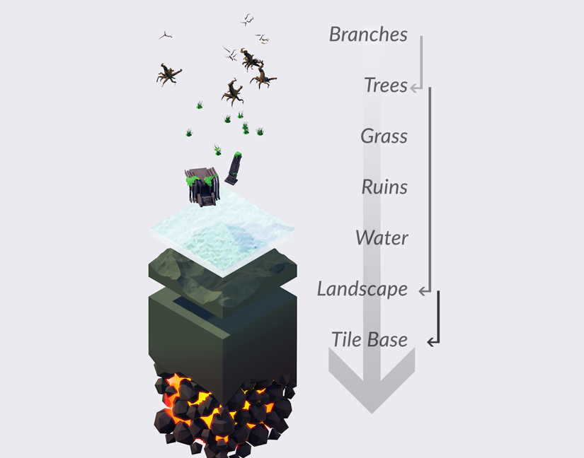

  We can see here that our tiles are actually very straightforward and won't really require any complicated node structures.

  - Branches connect to trees
  - Trees, grass, ruins, and water connect to landscapes
  - Landscapes connect to the tile base piece

  We could have made the landscape and the base piece one model, but separating them gives us additional options - like generating landscapes without the base piece, which we'll talk about in the [expansion section](#expansion).

  Anyway, we should now have a pretty good idea of how we'll need to lay out our nodes, so we can begin.

# Walkthrough

## Setup

  Import the Smithy Unity Package from your hard drive or directly from the Unity Asset store.

  To quickly test that Smithy has loaded properly, press CTRL + ALT + M to open the Manager window. If it opens properly, Smithy has installed correctly. If it throws an error, delete the "Smithy" folder and reinstall.

  The assets for this walkthrough can be downloaded for free through the [Unity Asset Store](#) or [directly](#). These assets are free to use, modify, and distribute (but not sell!) without attribution in any Unity project, Smithy-related or otherwise. Make sure these assets are located in a *Resources* folder.

## Base Tile

  Let's start with our base and build upwards. This way, we can run test generations at each step of construction to make sure we're on the right track.

  Import the **Base Tile** prefab from the *Assets/Resources/Swamp Tile/Meshes* folder. The prefab will contain two meshes: "Earth & Rocks" and "Lava". Assign matching materials in the *Assets/Resources/Swamp Tile/Materials* folder.

  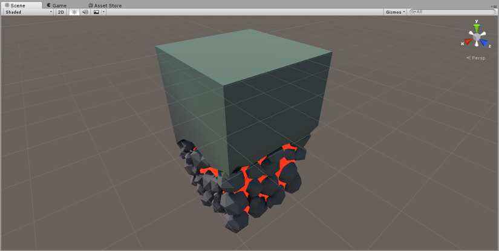

  In the **Inspector** tab, click **Add New Component** and select **Smithy**<i class="fa fa-long-arrow-right"></i>**Add Smithy Adapter**.

  The [adapter](../editor/adapter) will be added with two critical warnings. Ignore them for now (we'll deal with them shortly) and click the teal **Node Editor** button. In the node editor panel, select **Add Node**, <i class="success fa fa-plus-square"></i> (**Socket Type**), and **Midpoint**, like so:

  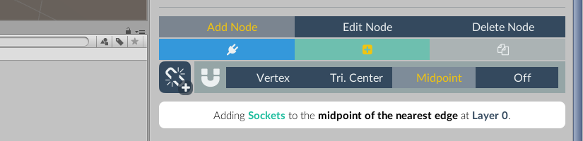

  Now, in the **Scene Tab**, hover over the middle of the tile base model. You'll see a magenta dot handle. Click once to add a node:

  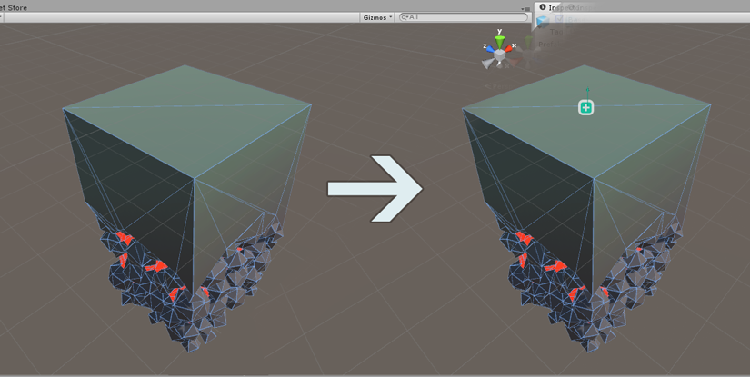

  This is the [socket](../editor/node#socket) node the landscapes will [plug](../editor/node#socket) in to. The <i class="success fa fa-plus-square"></i> icon marks it as a socket, and the little arrow is the [connection vector](../editor/node#connection-vector), which will tell Smithy how to orient the plug - in our case, straight "down" on to the flat top of our tile base. Imagine a physical socket whose walls are oriented straight upwards. You'd plug something in from above, straight down. That's what we've got here.

  So, we have our socket. Now we need to tell Smithy what sort of socket it is.  

  Return to the **Inspector Tab** and look under the node palette to the layer list. **Layer 0** should be expanded, and contain a single node named "(0.0, 3.0, 0.0)", the socket we just placed. Click the <i class="fa fa-tag"></i> icon to the right of the name and the gear icon.

  The tag popup will appear. Click the <i class="fa fa-tag">+</i> icon and enter "Terrain" into the form. Next, click the green checkmark button to add the Terrain tag to our Unity project. It should appear in the left-hand tag panel under **Available Tags**. Click it to move it to **Node Tags**. The process should look like this:

  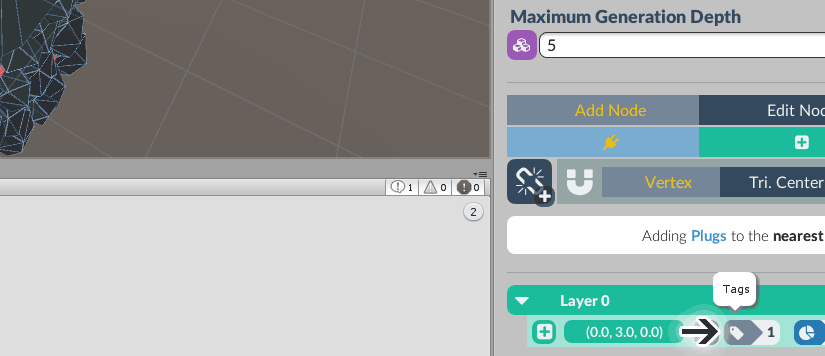

  What we've done is created a new tag, "Terrain", and assigned it to our Socket. This tells Smithy that the socket can accept Plugs that also carry the Terrain tag. However, there's nothing to plug in, because we don't have any "Terrain"-tagged Plugs. We don't have any plugs, period.

  Let's change that.

  Click the yellow <i class="fa fa-save">+</i> icon in the top-right corner of the Smithy Adapter component, and save the prefab to *Assets/Resources/Finished*.

## Terrain I

  **Disable** the tile base in the **Hierarchy Tab**. This will let us work on the next piece more easily. Now add one of the terrain pieces in the *Assets/Resources/Swamp Tile/Meshes/Terrains* folder to the hierarchy. It doesn't matter which one, add whichever one looks good to you. Assign the "Land" Material to it.

  Click its GameObject in the Hierarchy Tab and add a Smithy Adapter by clicking **Add New Component** and select **Smithy**<i class="fa fa-long-arrow-right"></i>**Add Smithy Adapter**.

  In the Smithy Adapter Inspector, navigate to the **Node Editor** tab and make sure the node palette is set to **Add Node**, <i class="fa fa-plug"></i> (**Plug Type**), and **Midpoint**.

  Now, hold down ALT and click and drag in the Scene Tab to move the Scene View camera *under* the terrain. Move the mouse to the diagonal line that bisects the bottom of the object, and click. If you've done everything right, you'll see the following:

  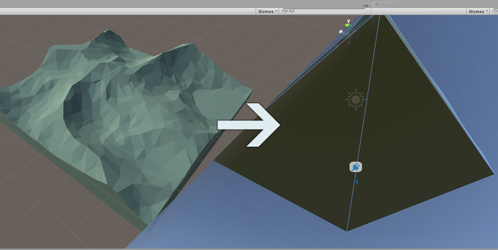

  We've added a plug node to the underside of the terrain, and we can see that the connection vector is angled straight down. Recall that our base piece's socket's connection vector is aligned straight up. When we generate pieces, terrains will be connected straight down to the base piece - exactly what we want.

  To quickly check how Smithy will align an object during generation, set the node palette to **Edit Node** and use the <i class="fa fa-hand-o-up"></i> (**Select**) **Mode** and click or hover over a node:

  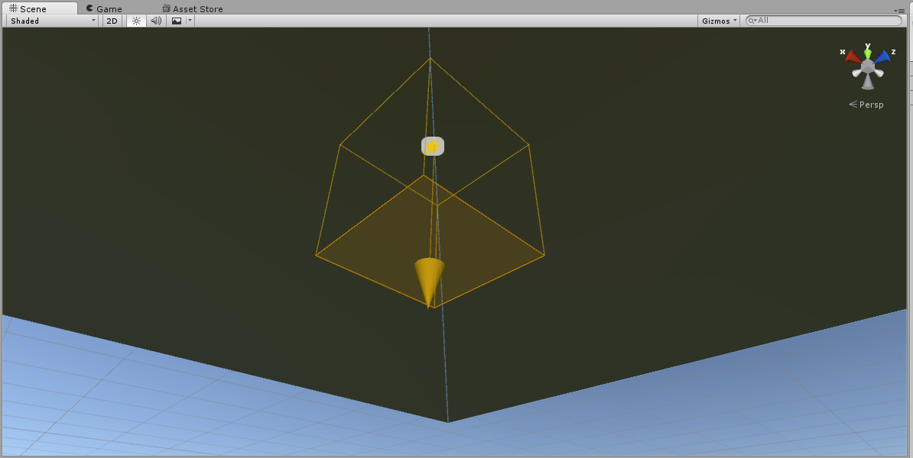

  The wireframe box represents the direction, scale and orientation of the object, and the shaded face represents the object's facing *in relation to the node*. For this plug node, we can think of the shaded face as the prongs of the plug. Our plug node is oriented straight down, with no change to rotation and scale. It'll slot right in to our socket node.

  All we have to do to finish this node is add the "Terrain" tag, so Smithy knows that this plug is available for the "Terrain"-tagged socket we placed on the base piece.

  Find the node in Layer 0 and click the <i class="fa fa-tag"></i> button. The "Terrain" tag will already be in the Available Tags pane. Click it to add the tag to our plug node.

  Finally, click the yellow <i class="fa fa-save">+</i> icon in the top-right corner of the component, and save the prefab to *Assets/Resources/Finished/Terrain*.

### Test Generation I

  We have a socket tagged "Terrain", and we have a plug tagged "Terrain". That's all we need to generate something in Smithy, so let's test it out and make sure we're on the right track.

  Double-check that the terrain piece has been saved through Smithy, then disable it in the hierarchy. Return to the base piece, and re-enable it.

  In the base piece's Smithy Adapter Inspector, click the orange **Assembler** button. Near the bottom of the panel, click either the blue <i class="fa fa-bolt"></i> (**Run Generator**) or purple <i class="fa fa-random"></i> (**Fill All**) buttons. You should see the following:

  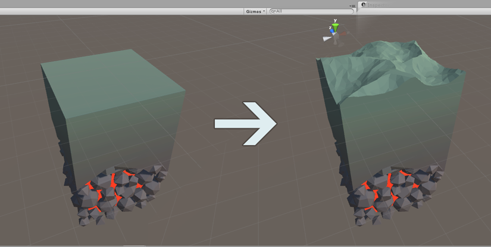

  The terrain should pop into existence right on top of our base piece. If it doesn't, double check that everything has been saved and is tagged appropriately.

  Now that we're sure we've got the basics working, we can begin decorating the terrain. Click the red <i class="fa fa-eraser"></i> (**Clear All**) button to remove the generated terrain object.

## Water

  Now, before we continue, let's think about the best way to implement our water. It'd be cool to have varying water levels, and maybe even some tiles completely dry, but we don't really care *which* tiles generate with water and which ones don't - we want these to be built procedurally, after all - but water would be appropriate for all terrain pieces.

  We *could* attach a water socket to each terrain piece we make, but that's work we don't need to do. Instead, let's add it to the base piece.

### Socket

  The best spot to add the water socket would be in the same place as the terrain socket. Smithy allows overlapping sockets, but overlapping sockets can get confusing in the editor, without a little effort. Let's start naming our sockets so we know what is what.

  In the Smithy Adapter Inspector on the base piece, click the <i class="fa fa-gear"></i> (**Node Settings**) button. The [Node Settings Window](../editor/node#node-settings-window) will appear. Next to the plug symbol in the top left of the window is a small grey <i class="fa fa-pencil"></i> icon. Click this and change the name from **(0.0, 3.0, 0.0)** to **Terrain**.

  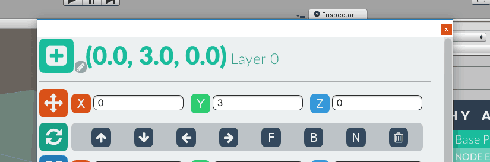

  Click the green checkmark button on the bottom of the window to close it, and take a look at the node palette in the Adapter inspector. Make sure that the palette is set to  **Add Node**, <i class="fa fa-plus-square"></i> (**Socket Type**), and **Midpoint**.

  In the Scene View tab, click on the "Terrain" node on the top of the base piece. The scene view won't change, but a new node named **"(0.0, 3.0, 0.0)** will appear in the Layer 0 list.

  Repeat the renaming process and change the name of this new node to **"Water"**.

  Click the <i class="fa fa-tag"></i> button and add a new tag: "Water". Then, click the "Water" tag in the Available Tags panel to add it to the node. The tag popup for the water socket should look like this:

  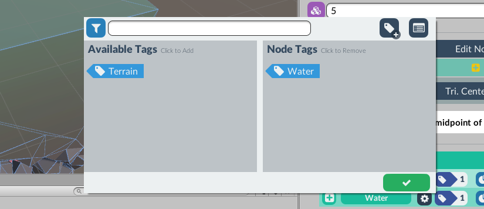

  Recall that we want the water to be generated sometimes, but not all of the time. We can set that up pretty quickly.

  Click the blue <i class="fa fa-pie-chart"></i> button to the right of the node tag panel button. Use a [preset](../editor/adapter#preset) or drag the slider to a percentage that seems suitable. For this tutorial, I've set the node to around 88%.

  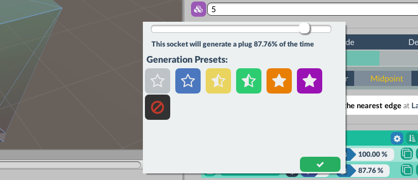

  This means that the node will be filled 88% of the time. If we generate 10 tiles, we can expect about nine of them to be wet.

  Now, click the *green* <i class="fa fa-save"></i> icon in the top-right corner of the Adapter component to commit our changes to the prefab, and disable the base piece object in the hierarchy so we can work in a clean scene view.

### Plug

  It's time to set up our water object. Head into the *Assets/Resources/Swamp Tile/Meshes* folder and put the Water model into the scene. Assign its material and add a Smithy Adapter component.

  Exactly the same way we added the plug to the terrain, spin the Scene View camera around to the flat underside of the water object and **Add** a <i class="fa fa-plug"></i> (**Plug**) to the **Midpoint** of the diagonal that bisects the underside, like so:

  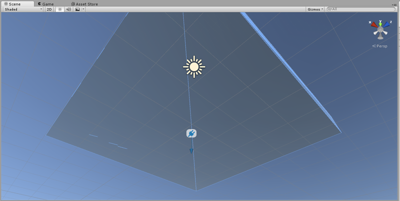

  Use the tag panel to add the "Water" tag to this plug. Save the prefab to *Assets/Resources/Finished/Terrain*

### Jitter

  Our generated tiles are going to look a lot less dynamic if tile that spawns with water has the same water level. To help with that, Smithy comes with jitter controls.

  [Jitter](../editor/node#jitter) controls are random vectors applied to an object's position, rotation, and scale on generation. We can use a Y-scale jitter to stretch the water object's mesh, controlling our water level.

  Open the **Node Settings Window** by clicking on the <i class="fa fa-gear"></i> button next to the node's name (actually its position, right now). Scroll down to the jitter panel, which is marked with a purple <i class="fa fa-bullseye"></i> icon.

  Click the <i class="fa fa-plus"></i> button on the right side of the panel to add a new jitter control. Select **Scale Jitter (Vector)** from the drop-up menu. This will let us isolate the Y-axis - a uniform jitter would scale in all dimensions equally.

  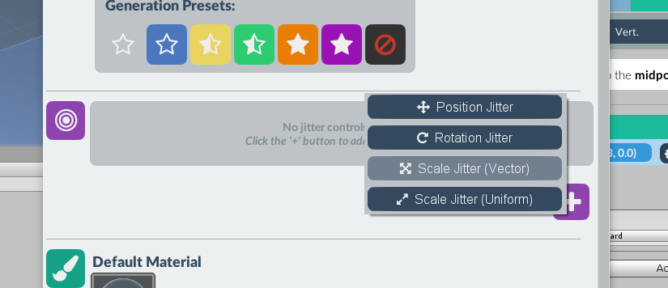

  For now, let's zero out the X- and Z-axis sliders. We only want to scale the Y-axis.

  Drag the X- and Z-axis sliders to the middle. This sets their minimum and maximum range to 0. Set the Y-axis slider to values you think would look good (we'll check in a second). Don't set the minimum value below zero here, though, that will invert our water mesh.

  I decided to set the Y-axis values to -0.98 and 0.71 respectively:

  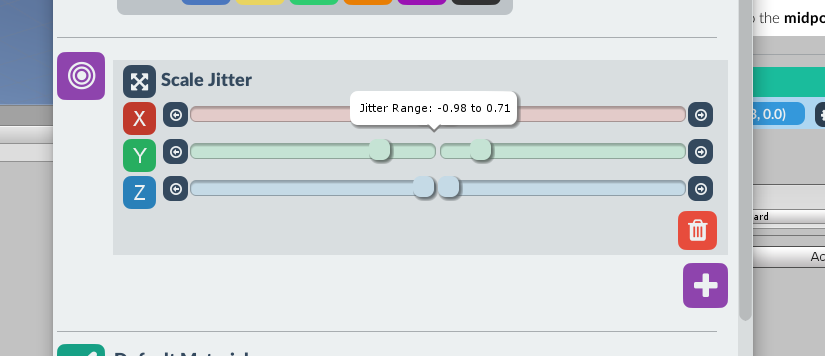

  When you're happy with your jitter range, click the green check mark to commit all changes to the node, then return to the Adapter inspector and click the green <i class="fa fa-save"></i> icon in the top-right corner. Go ahead and disable or delete the Water GameObject in the Hierarchy Tab.

### Test Generation II

  Re-enable the base piece in the Hierarchy. In the Adapter Inspector, click the orange **Assembler** tab. Click the blue <i class="fa fa-bolt"></i> (**Run Generator**) button a few times. Here's a sample of what you should see:

  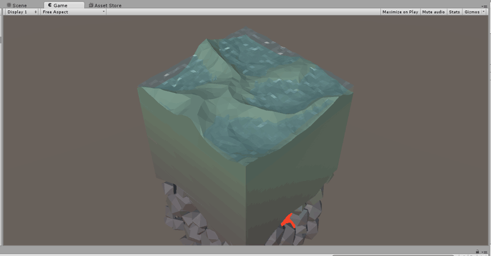

  You should see the landscape being flooded most of the time, at varying water levels. Sometimes, however, they'll be no water at all. Here's what's happening:

  - The base piece is generating a landscape 100% of the time.
  - The base piece is (more or less) rolling some dice to see if it should generate a water object.
    - If so:
    - the water object is being scaled along the Y-axis, then...
    - connected to the socket on the base piece.

  Click the button a few more times to make sure it's looking good, and adjust the water socket generation probability and water plug's jitter values to taste.

  When you're done, click the red <i class="fa fa-eraser"></i> (**Clear All**) button and disable the base piece in the Hierarchy Tab.

## Terrain II

  Re-enable or instantiate the Terrain piece from earlier.

  Now, click the blue <i class="fa fa-clone">+</i> button at the bottom of the Adapter inspector to add a new node layer to this adapter.

  A new layer, titled **Layer 1** will appear under Layer 0. You'll notice that Layer 0 has turned dark blue, and Layer 1 is now teal. This means that Layer 1 is the *active layer*. If we add any nodes now, they'll get placed in Layer 1. To switch active layers, click the layer's name (but don't do that now).

  Click the light blue <i class="fa fa-gear"></i> icon to the right of Layer 1. This opens the Layer Settings Window.

  You'll see that there are no nodes present in the layer right now. That's fine, we'll get to that shortly. For now, click the grey <i class="fa fa-pencil"></i> to change the layer's name (just like the Node Settings Window) from "Layer 1" to **"Grass"**, then commit the changes to the Adapter and close the window. Your layer list should look like this:

  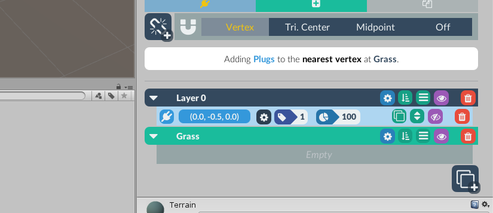

  Go to the Node Palette and set **Add** a <i class="fa fa-plus-square"></i> (**Socket**) and **Off**. Ensure that the new "Grass" layer is active.

  Now, in the Scene View Tab, add a handful of nodes where you'd like grass to grow:

  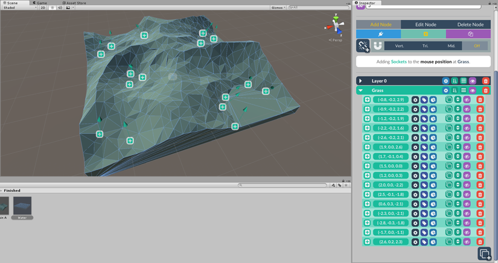

  I ended up adding 16 grass nodes. You can add as many as you like -- because grass won't have a sub-object hierarchy, we don't really have to worry about adding generational complexity. If the big list of nodes in the inspector bothers you, click the caret to collapse the node list. We actually won't be touching the nodes individually. Instead we'll set up everything at once using the Layer Settings Window.

### Grass Layer Settings

  Click the blue <i class="fa fa-clone">+</i> grass layer settings button again. You'll notice that now, the window has been populated with all of the nodes we just added:

  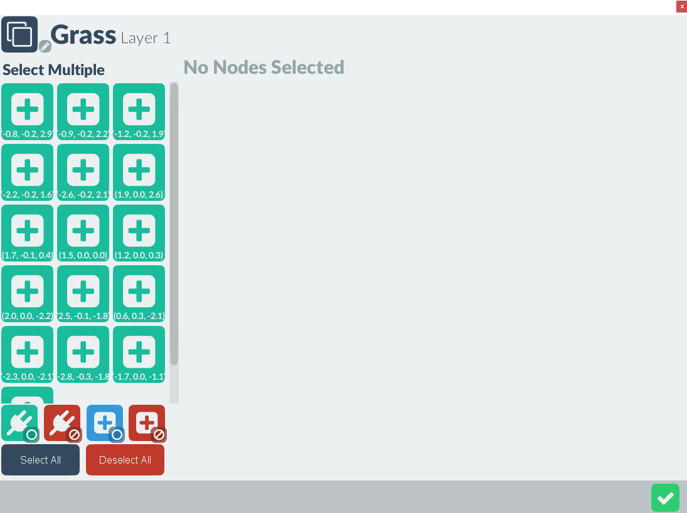

  Click the blue **Select All** button in the lower left side to select all of our grass sockets. You'll notice immediately that the right column of the window turns into a control panel very similar to the Node Settings Window.

  The first row of X/Y/Z values will change the position of the node. Set the Y-value to -0.05 and click the green check mark to move all selected nodes by this value.

  Why? Well because we want our grass models to look like they're part of the scene, and we'll be putting our plug nodes right on the bottom of the grass mesh. If we kept the nodes on the surface of our Terrain piece, they'd look like they were almost floating - just *baaarely* touching the ground. It'd look weird. Getting them down in the ground just a little bit will look way more natural.

  Close (or move aside) the Layer Window. Your terrain piece should look like this:

  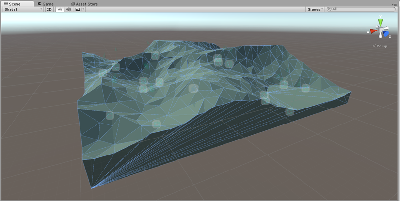

  The node icons are transparent because they're within the object mesh. This is what we want.

  You might have noticed, when placing nodes, that the node's [connection vectors](../editor/node#connection-vector) are reflections of the normal the node is placed against. Most of the time, this is what you want -- flat surfaces will sit flush with each other. However, we're laying the sockets for grass. Grass grows towards the sun, and if our grass is growing everywhere at odd angles it's going to look like fur or something, not grass. We need these connection vectors to be oriented straight up.

  Open up the Layer Settings Window again, if you've closed it. **Select All** once again.

  The fourth row down, the <i class="fa fa-external-link-square"></i> icon, will quick-set all connection vectors. Click the first button, the <i class="fa fa-arrow-up"></i> button, which sets all connection vectors to **world up**.

  Just below that in the layer window is the probability selector. Press the blue <i class="fa fa-star-o"></i> (**Uncommon**) button. This will prevent all of our grasses from spawning every time, making the finished tiles look far more organic. The Uncommon setting is set to 60% by default, but this can be changed in the [probability preset manager](../editor/manager#probabilty-preset-manager).

  Below probability is the Tag panel. Like before, click the <i class="fa fa-tag">+</i> button and add the tag "Grass". Click the new tag in the Available Tags column to add it to all of the selected nodes.

  Finally, we're going to mass-add jitter values. The Jitter panel is below the tag panel. Click the <i class="fa fa-plus"></i> button to add a **Rotation Jitter**, and again to add a **Vector Scale Jitter**

  We only want the grass to be able to rotate around their Y-axes, but we don't need any limits on how much they can rotate. In the Rotation Jitter control, zero out the X- and Z- axes, and max out (-180 to 180) the Y axis.

  In the Vector Scale Jitter control, set all axes to a similar, small value to add a little variation to how our grass will grow. I chose -0.30 and 0.30, for each axis.

  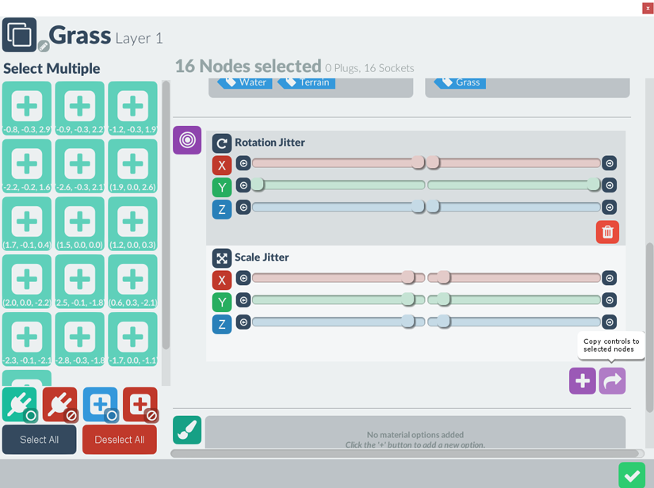

  Click the purple <i class="fa fa-mail-forward"></i> button to copy this jitter control to all selected nodes. Exit the menu, and save changes in the adapter inspector. Disable the terrain in the hierarchy so we have an empty scene view to work in.

## Grass

  Go to the *Assets/Resources/Swamp Tile/Meshes/Grass* folder and drag "Grass A" into the heirarchy. Apply the "Moss" material. Add a Smithy Adapter component.

  In the Node Editor tab, make sure that the palette is set to **"Add Node"** and **"Plug"**. Instead of adding a node through the viewport, click the <i class="fa-chain-broken">+</i> button to add a new, unanchored node. The node should appear at (0,0,0) like so:

  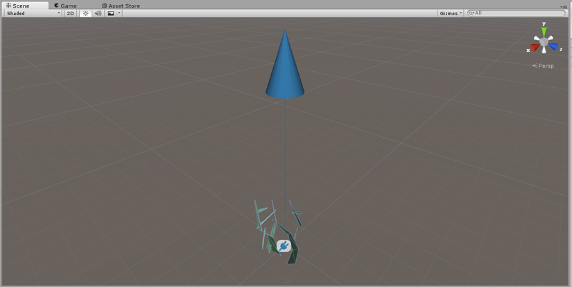

  Now, switch the node palette to **Edit Node** / **Select** mode, and click the node in the Scene View. It'll turn bright green. You'll notice the connection vector is pointed directly up - we don't want this. Our grasses will instantiate upside down.

  To fix this, click the final palette option, the <i class="fa fa-external-link-square"></i> (**Adjust Connection Vector**) button.

  Now, click the downward arrow in the snap menu to set the connection vector to **world down**. You should see this:

  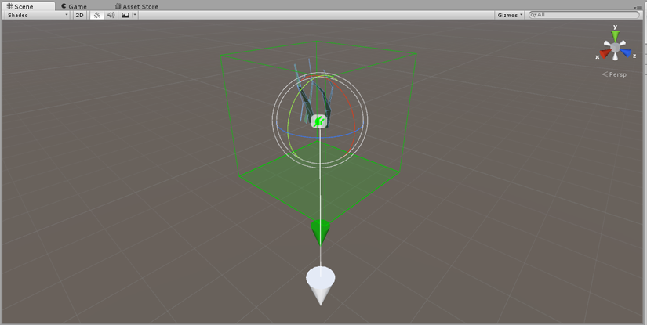

  Add the "Grass" tag to the node, using the <i class="fa fa-tag"></i> button.

### Copying Adapters

  Don't delete or disable the grass GameObject in the hierarchy. Instead, select and drag all of the remaining grasses from the *Meshes/Grass* folder into the hierarchy, and assign the Moss material to them. You can do this easily by selecting all of the grasses in the Hierarchy Tab and dragging the Moss material into the Inspector Tab.

  Now, select only "Grass A", the one with the Smithy Adapter on it. Right click on the very top of the Smithy Adapter Inspector and click **"Copy Component"**:

 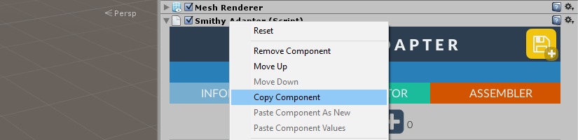

 Group select the **other** grass objects (grasses B through F). Right-click on the Transform component and select **Paste Component As New"**:

 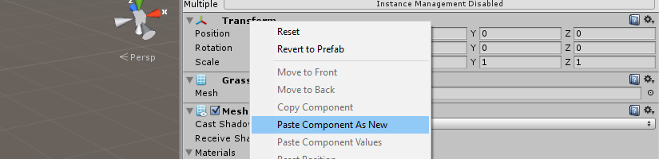

 This will copy the Smithy adapter, along with our plug node, to each Grass object. This saved us a bunch of time, and is something to definitely remember whenever preparing a bunch of assets that are going to be handled the same way.

 Save **each** grass object to prefab, through the Smithy adapter, then remove them from the heirarchy.

### Test Generation III

   Go back to the base piece and run the Assembler generator a few times:

   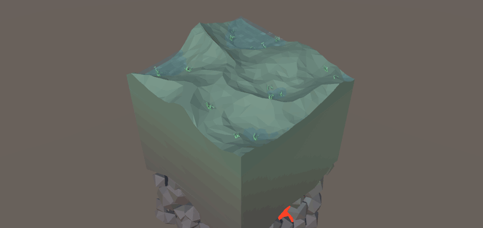

   If everything looks good, click the red <i class="fa fa-eraser"></i> (**Clear All**) button and disable the base piece.

## Trees

### Sockets

  We're going to repeat the grass process with the trees.

  Activate Terrain A in the hierarchy and add a new node layer, named "Trees". Add a few socket nodes, wherever you think is suitable (Click the <i class="fa fa-eye"></i> button on the inactive layer to hide the other layers and reduce visual clutter). These trees have pretty wide root systems, though, so it's best to keep them away from the edges.

  

  Now, select all of these sockets in their layer window. Use the techniques we've covered in the last several steps to do the following:

- Add a Y-axis position offset like we did with the grass, but decrease the value to -0.1
- Set all connection vectors to **world up** by clicking the upwards-facing arrow in the connection vector settings panel
- Create a new tag, "Tree", and add it to the sockets
- Set the probability to <i class="fa fa-star-o"></i> (**Rare**)
- Apply a Y-axis rotation jitter control with limits at -180 degrees and +180 degrees.
- Close the Layer Settings Window and save through the adapter.

### Plugs

  Again, like with the grass, we're going to batch all of our tree objects by defining the plug node on one tree and copying the adapter to the other trees.

  Pull all of the tree meshes from the *Meshes/Trees* folder into the hierarchy. Apply the "Wood" material to them.

  Now, select Tree A, and:

- Add a new unanchored node with the <i class="fa fa-chain-broken">+</i> button
- Select the node through the palette's **Edit Node** / **Select** mode.
- Click the downward-facing arrow in the <i class="fa fa-external-link-square"></i> (**Adjust Connection Vector**) snap menu to set the connection vector to **world down**
- Use the Tag Panel to add the "Tree" tag to the node.
- Right-click on the Smithy Adapter inspector title and select "Copy Component"
- Shift-select and paste the component to the rest of the tree objects.

Save each of the trees through the Smithy adapter to the *Finished* folder. Remove them from the hierarchy, and check your work by using the Assembler generator on the base piece. It should generate something like this:

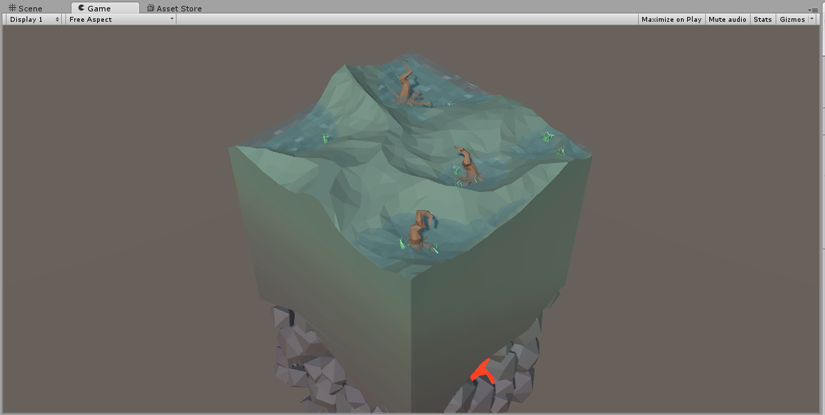

If it looks a little off, don't worry. We'll take a final pass near the end and tweak everything to get it perfect. For now, make sure that trees don't have roots hanging off of the edge. If they do, go back into the Terrain A Tree nodes and move them towards the center.

## Branches

  [[[CHANGE THIS -- ALIGN ALL BASES WITH y 0]]]

  This part, unfortunately, can't be batched. The good news is that there are only four, and they'll add a ton of variety.

  Go into the *Meshes/Trees/Branches* folder and grab "Branch A". Assign the "Wood" material and add a Smithy Adapter.

  Rotate the branch so you can see the base. You'll notice the branch seems to "clip out" back here because there's no geometry in that area. This is fine, because we're going to manually position the plug node.

  Enter edit mode and keep the palette at default settings. Click one of the vertices near the base of the branch:

  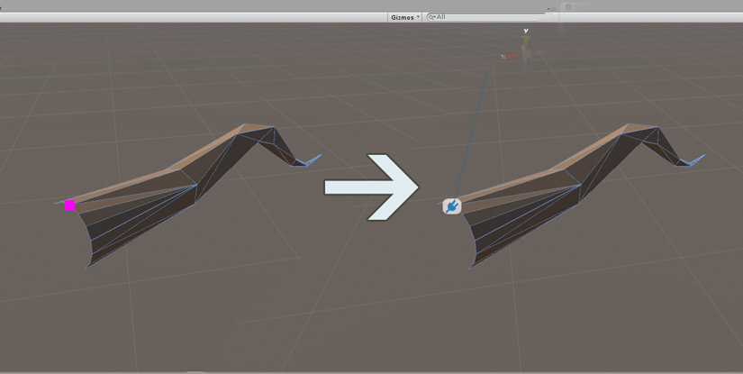

  Neither the position nor the connection vector of the node is what we want. Let's change that.

  Enter the **Edit Node** mode from the palette and click the node in the Scene View to select it.

  Now, click the <i class="fa fa-arrows"></i> button in the palette. In the Scene view, manipulate the movement handles to position the node roughly in the middle of the branch's base. Then, inset the node just a little into the body of the branch, like so:

  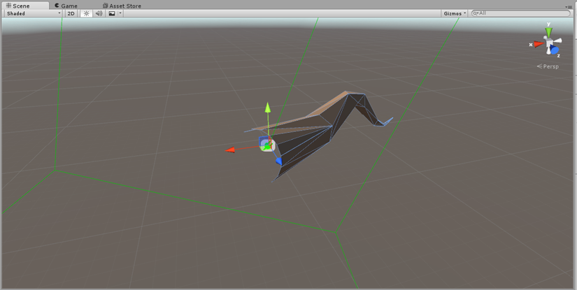

  Finally, click the button labeled "C" (**"Align to Object Center"**) arrow in the <i class="fa fa-external-link-square"></i> (**Adjust Connection Vector**) snap menu. You might also want to tweak the connection vector manually, depending on how you positioned the node. In the end, the vector should look like this:

  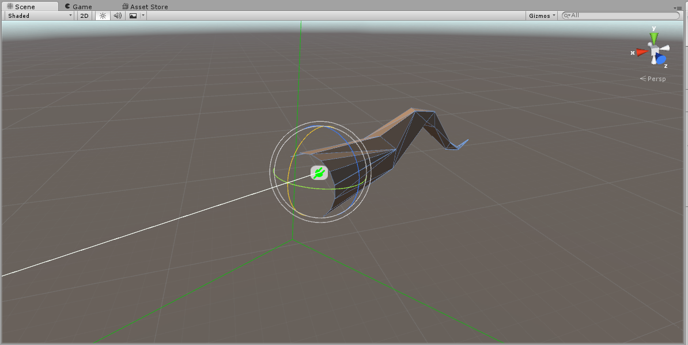

  Add a new tag, "Branch", and save this branch as a prefab through the Smithy Adapter.

  Now, repeat this process for the rest of the branches in the *Meshes/Trees/Branches* folder.
