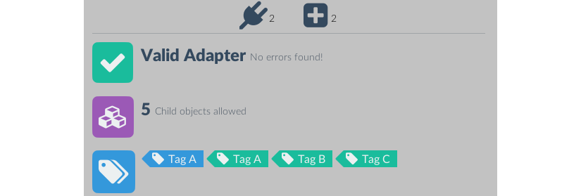
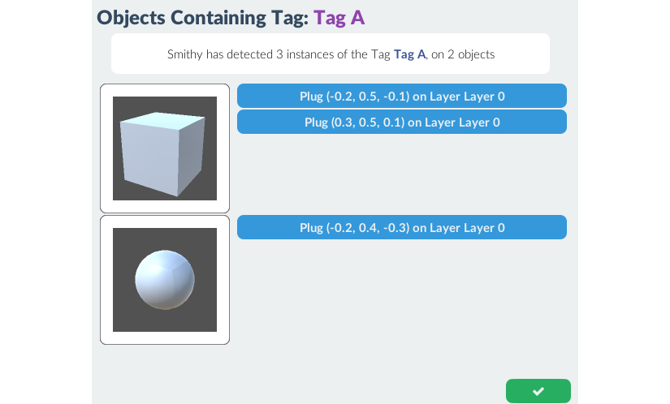
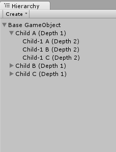
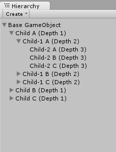
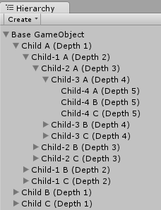
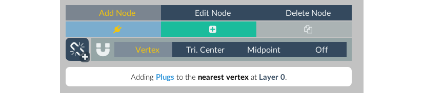
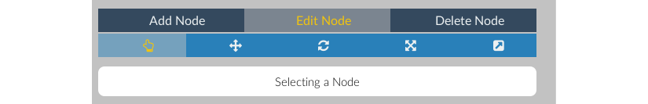

# Overview
  Smithy Adapters are [Components](http://docs.unity3d.com/Manual/UsingComponents.html) that contain [Nodes](node), and are required for [procedurally generating objects](../generation).

  Adapters are added by clicking <span class="label label-default">Add Component</span> in the GameObject inspector, and selecting <span class="label label-default">Smithy</span> <i class="fa fa-long-arrow-right"></i> <span class="label label-default">Add Smithy Adapter</span>

  <div class="panel panel-info">
  <div class="panel-body">
  Please note that Smithy can only load and instantiate Prefabs that are located in the */Assets/Resources* folder of your Project, or [Asset Bundles](./generation#methods) that have already been loaded.
  </div>
  </div>


# Inspector
  Adapters are equipped with a custom inspector, which is the principal point of access for working with [Nodes](node). Once a Smithy Adapter component is added to a GameObject, it will appear in that GameObject's component inspector.

  Very narrow inspector layouts may make some UI components overlap. If this is the case, widen the inspector window to a comfortable width.


## Navigation


  The Navigation panel accesses the Information Panel, the Node Editor, and the Object Assembler.
  The Node Editor and Object Assembler are only available when the GameObject is active in the hierarchy. If the GameObject is saved as a prefab, these options will be disabled.

### Saving
  Smithy uses asset labels and prefab assets during procedural generation. Therefore, GameObjects must be saved as prefabs before they can be used by Smithy.

  Correctly saved and labeled prefabs are crucial to Smithy's operation, so each Adapter is able to manage the saving of it's linked prefab. Simply activate the autosave in the save menu once a prefab has been linked.

  <div class="panel panel-warning">
  <div class="panel-body">
  For best results, let Smithy manage the saving and updating of prefabs with that have Smithy Adapters. Smithy will ensure that these prefabs are labeled correctly prior to building, and useable in generation. Manually saving and updating Smithy prefabs is not recommended - it may work, but can't be guaranteed.  
  </div>
  </div>

---

  The top right corner of the navigation panel contains the Save indicator. The icon changes based on state:

Indicator | Status | Description
:-------- | :----: | :----------
<button type="button" class="btn btn-warning btn-sm"><i class="fa fa-save fa-4x"></i></button> | **Unsaved**<br>*(no prefab)* | This GameObject has not been saved as a prefab. Clicking this icon will allow you to save the GameObject and create a prefab connection.
<button type="button" class="btn btn-success btn-sm"><i class="fa fa-save fa-4x"></i></button> | **Unsaved** | This GameObject has a prefab connection but has unsaved changes. Clicking this icon will save changes to the prefab, or, allow you to activate Smithy's autosave feature.
<button type="button" class="btn btn-danger btn-sm"><i class="fa fa-ellipsis-h fa-4x"></i></button> | **Saving** | This GameObject is currently saving any changes. This should only take a brief moment, but allow it to save before starting a build or entering Game mode.
<button type="button" class="btn btn-primary btn-sm"><i class="fa fa-check-circle fa-4x"></i></button> | **Prefab OK** *(autosave off)* | This GameObject has a prefab connection that is current with any changes made. Autosave is not on and the GameObject will need to be saved manually. Click to **activate** autosave.
<button type="button" class="btn btn-info btn-sm"><i class="fa fa-check-circle fa-4x"></i></button> | **Prefab OK** *(autosave on)* | This GameObject has a prefab connection that is current with any changes made. Autosave is on. Click to **deactivate** autosave.

---

# Information Panel

  The information panel is the first navigation panel option and provides an at-a-glance display of all critical Node information. The information panel is comprised of a warning panel, a generation depth counter, and a tag list panel.  

## Warning Panel
  The warning panel will display any issues that might affect the operation of this adapter or its nodes. It has two states:

   |
  :-----:|:-----:
<button type="button" class="btn btn-success btn-sm"><i class="fa fa-check fa-5x"></i></button> &nbsp;&nbsp;&nbsp;**Valid** |<button type="button" class="btn btn-danger btn-sm"><i class="fa fa-hashtag fa-5x"></i></button> &nbsp;&nbsp;&nbsp;**Problems Detected**<br>*(where # is the number of issues)*

Issues that Smithy detects are arranged into three categories:

Warning | Important | Critical
:------- | :--------- | :--------
<button type="button" class="btn btn-warning btn-sm"><i class="fa fa-exclamation-trivector fa-3x"></i></button> | <button type="button" class="btn btn-danger btn-sm" style="background-color:#d35400;"><i class="fa fa-exclamation-trivector fa-3x"></i></button> | <button type="button" class="btn btn-danger btn-sm style="background-color:#e74c3c;""><i class="fa fa-exclamation-trivector fa-3x"></i></button>
These will not cause problems with generation, but may potentially produce undesirable results | These issues are will generate poor or unexpected results, but will not cause errors | This issues are serious and will throw errors or prevent any Nodes on this adapter from being detected.

Alt-clicking the warning icon will open the relevant [troubleshooting](../troubleshooting) link in a new browser window.

## Generation Depth Panel
  Displays the [maximum generation depth](#generation-depth) for this adapter.

## Tag List Panel
  Displays a list of all Tags present on the Adapter's nodes. Tags present on Plugs will be shown in <span class="label label-info">blue</span>, and Tags present on Sockets will be shown in <span class="label label-success">teal</span>.

  Clicking a tag will open the Tag Search popup window:
  
  This will list all Smithy-enabled objects with matching tags, as well as the specific nodes that are set to the same tag.

---

# Node Editor Panel


  The node editor panel is used for adding, editing, and deleting Plug and Socket nodes. It consists of the Generation Depth Panel, Node Palette, and Layer Panel.

### Generation Depth


  The generation depth panel sets an ```int``` value the maximum number depth of children this adapter can generate, if it is the base object.

  In other words, a base object with a maximum generation depth of *n* can have a GameObject hierarchy that is, at most, *n* levels deep.

  For example:

  | |
  :----:|:----:|:----:
  **depth = 2** | **depth = 3** | **depth = 5**
  <br>*(13 GameObjects at Width = 3)* | <br>*(40 GameObjects at Width = 3)* | <br>*(364 GameObjects at Width = 3)*

  <div class="panel panel-danger">
  <div class="panel-body">
  Please keep in mind that while generation depth cannot be set to infinity, it can be set very high, and Nodes can be structured to produce hierarchies that expand exponentially. Generation calls that produce very deep hierarchies - especially multiple calls per frame - will *severely* impact performance.
  </div>
  </div>

  The default maximum generation depth is **5**


### Node Palette
  The Node Palette contains the controls to add, move, adjust, and delete nodes.

#### Add Node Tab


| | |
|:---:|:---:|:---:
<i class="fa fa-plug fa-3x" style="color:#3498db"></i> | <i class="fa fa-plus-square fa-3x" style="color:#1abc9c"></i> | <i class="fa fa-copy fa-3x" style="color:#9b59b6"></i>
|Add Plug| Add Socket | Clone Node

  From left to right, the tabs under the add node tab switch the add mode to Plug, Socket, and Clone. Moving the mouse over the object mesh in the [Scene View Window](http://docs.unity3d.com/Manual/UsingTheSceneView.html) will draw a magenta dot - this is the placement point for new nodes. Left click the mouse, and a new node of the selected node type will be at the placement point.

  

<div class="well">
Clone mode clones the node that is currently selected in the Layer Panel and adds it at the placement point, or as an unanchored node.
</div>

  Smithy manages an automatically-generated MeshCollider specifically for adding and moving nodes around object models, so you can add nodes directly to the surface of your mesh. To help with placement, the Node Palette includes several mesh snapping options:

   Vertex | Triangle Center | Midpoint | Off
   ---- | ---- | ---- | ----
   Snaps the placement point to the vertex nearest the mouse cursor | Snaps the placement point to the centroid of the face trivector under the mouse cursor | Snaps the placement point to the midpoint of the edge nearest the mouse cursor | Disables snapping. The placement point will appear at the intersection of a ray fired from the mouse position.

  However, having a mesh isn't necessary, and Smithy will operate on meshless GameObjects. This is useful for creating nodes that handle pure code functions like AI behavior, mesh-agnostic particle effects, audio modifiers, and anything else that is useful for procedural generation but does not necessitate a mesh.

  Either way, clicking the <button type="button" class="btn btn-primary btn-sm"><i class="fa fa-unlink fa-lg"></i></button> button will add a new node to (0,0,0).

#### Edit Node Tab



| | |
:---:|:---:|:---:|:---:|:---:
<i class="fa fa-hand-o-up fa-3x" style="color:#3498db"></i> | <i class="fa fa-arrows fa-3x" style="color:#3498db"></i> | <i class="fa fa-external-link-square fa-3x" style="color:#3498db"></i>
Select Node | Move Node | Rotate Node | Scale Node | Adjust Connection Vector

  From left to right, the tabs under the Edit Node Tab set selection mode, move mode, and connection vector mode.

---

  In **selection mode**, left-clicking on a node in the Scene View Window will select that node in the inspector. The Gizmo icon will turn yellow to highlight when it's under the mouse pointer, and green when it has been selected. Nodes can also be selected by clicking the name of the node in the [Layer Panel](#layer-panel).

---

  **Move mode** allows repositioning of the selected node. If a node is not currently selected (highlighted green in the Scene View and layer panel), this option will be disabled.

  Move mode appends a subpanel to the palette with the following icons:

  

  By default, move mode draws a Unity movement handle in the Scene View that can be used to drag the node around the edit area.

  By clicking the <button type="button" class="btn btn-primary btn-sm"><i class="fa fa-magnet fa-lg"></i></button> toggle, the movement handles will disappear and the magenta placement point will appear when the mouse enters the Scene View. Left clicking in the scene view will set the node's position to the placement point position.

  <a id="connection-vector-snap"></a>

  By default, a node moved in this manner will recalculate its' [Connection Vector](node/#connection-vector) (it will try to align to the new surface normal). To prevent this behavior, click the <button type="button" class="btn btn-primary btn-sm"><i class="fa fa-external-link-square fa-lg"></i></button> button, which will toggle connection vector preservation.

  ---

  **Adjust Connection Vector mode** draws a Unity rotation handle at the node position. This can be dragged in any axis to set the [Connection Vector](node#connection-vector) of the node. This mode will also append the following connection vector quick-set subpanel to the palette:

 | | | | | | |
 :---:|:---:|:---:|:---:|:---:|:---:|:---:|:---:|
 <button type="button" class="btn btn-primary btn-sm"><i class="fa fa-arrow-up fa-3x"></i></button> | <button type="button" class="btn btn-primary btn-sm"><i class="fa fa-arrow-down fa-3x"></i></button> | <button type="button" class="btn btn-primary btn-sm"><i class="fa fa-arrow-left fa-3x"></i></button> | <button type="button" class="btn btn-primary btn-sm"><i class="fa fa-arrow-right fa-3x"></i></button> | <button type="button" class="btn btn-primary btn-sm"><h4>&nbsp;&nbsp;&nbsp;**F**&nbsp;&nbsp;&nbsp;</h4></button> | <button type="button" class="btn btn-primary btn-sm"><h4>&nbsp;&nbsp;&nbsp;**N**&nbsp;&nbsp;&nbsp;</h4></button> | <button type="button" class="btn btn-primary btn-sm"><h4>&nbsp;&nbsp;&nbsp;**B**&nbsp;&nbsp;&nbsp;</h4></button> | <button type="button" class="btn btn-primary btn-sm"><h4>&nbsp;&nbsp;&nbsp;**C**&nbsp;&nbsp;&nbsp;</h4></button>
 World Up | World Down | World Left | World Right | World Forward | World Backward | Nearest Surface Normal | Align to Object Center

 Clicking any of these options will directly set the node's connection vector.


#### Delete Node Tab

  Delete mode will delete the node nearest the mouse cursor when left-clicking in the scene view.

#### Palette Information Panel


  For clarity's sake, there is an information box located at the bottom of the palette. This box reports the currently selected option, or set of options.

### Node Layers

  Nodes on an adapter are collected into layers. These layers are just an organizational tool - they don't affect generation - but can be used to edit multiple nodes at once.

  All adapters have at least one layer. Smithy does not allow adapters without layers, and deleting the last layer on an adapter will replace it with a new layer. Layers without nodes are, however, valid.

  The current active layer (the layer that will contain nodes added through the [Node Palette](#node-palette)) is colored <span class="label label-success">teal</span>. Inactive layers are colored <span class="label label-primary">navy</span>, and can be activated by clicking the layer name. Only one layer can be active at a time.

  <div class="well"> Nodes on inactive layers will still contribute to procedural generation, layers are just an organizational tool. </div>

  

  | |
  :---:|:---
    <button type="button" class="btn btn-primary btn-sm">&nbsp;&nbsp;<i class="fa fa-caret-down fa-3x"></i>&nbsp;&nbsp;</button> | Expands or collapses the layer's node list
    <button type="button" class="btn btn-success btn-sm">**Layer 0**</button> | The active layer's name.
    <button type="button" class="btn btn-primary btn-sm">**Layer 0**</button> | An inactive layer name. Click to set as the active layer.
   <button type="button" class="btn btn-info btn-sm"><i class="fa fa-gear fa-3x"></i></button> | Opens the [Layer Window](#layer-window)
   <button type="button" class="btn btn-primary btn-sm" style="background-color:#27ae60;border-color:#27ae60;"><i class="fa fa-sort-amount-asc fa-3x"></i></button> | Reverses the ordering of the layer's node list.
   <button type="button" class="btn btn-primary btn-sm" style="background-color:#27ae60;border-color:#27ae60;"><i class="fa fa-reorder fa-3x"></i></button> | Sort nodes. Nodes can be sorted by [type](node#node-type), [name](node#name), [tags](node#tags), [selection probability](node#selection-probability), [position](node#position) (x, y, or z), or by visibility.
   <button type="button" class="btn btn-primary btn-sm" style="background-color:#9b59b6;border-color:#9b59b6;"><i class="fa fa-eye fa-3x"></i></button> | Toggle visibility for all nodes in the layer. Invisible nodes will still contribute to generation.
   <button type="button" class="btn btn-danger btn-sm"><i class="fa fa-trash fa-3x"></i></button> | Delete the layer and all nodes it contains.

   New layers can be added by clicking the <button type="button" class="btn btn-primary btn-sm"><i class="fa fa-clone fa-lg">+</i></button> button below the layers panel.

   The nodes in each layer contain their own control pills, which are explained in the [Node Editor Pills](node#node-editor-pill) section of the documentation on nodes.

#### Layer Window


  The layer window allows several of the [Node Window](node/#node-window) controls to be applied to multiple nodes at once.

  The left column is the node selection set. This is a list of all nodes on the layer, by type and name. The bottom of this column contains buttons for selecting/deselecting all plugs, selecting/deselecting all sockets, and selecting/deselecting all nodes.

  ---

  The right-hand column contains the following five controls:

  <div class="well"> The functions of these controls are identical to the controls in the [Node Settings Window](node#node-settings-window). More information about each control is available on that page. </div>


  | |
  :---:|:---
  <button type="button" class="btn btn-warning btn-sm"><i class="fa fa-external-link-square fa-3x"></i></button> | Contains the same set of connection vector quick-set buttons as in the Adjust Connection Vector Mode of the [Node Palette](#node-palette). These buttons function identically to the palette set, and when clicked, the connection vectors of all selected nodes  will be changed.
  <button type="button" class="btn btn-info btn-sm"><i class="fa fa-pie-chart fa-3x"></i></button> | Clicking a [Preset](manager/#probabilty-preset-manager) will apply values to that preset to all selected nodes.
  <button type="button" class="btn btn-info btn-sm"><i class="fa fa-tags fa-3x"></i></button> | This is the same [Tag Manager](node#tag-manager) as in the [Node Settings Window](node#node-settings-window), but changes here will be applied to all nodes in selection. Tags that appear in multiple nodes will be marked with a number corresponding to the number of nodes selected that contain the tag.
  <button type="button" class="btn btn-info btn-sm" style="background-color:#8e44ad;border-color:#8e44ad;"><i class="fa fa-bullseye fa-3x"></i></button> | Like the [Node Settings Window](node#node-settings-window), but applies the entered [jitter values](node#generation-jitter) to each node in the selection.
  <button type="button" class="btn btn-info btn-sm" style="background-color:#27ae60;border-color:#27ae60;"><i class="fa fa-paint-brush fa-3x"></i></button> | [Material Options](node#material-options) added here will be copied to all nodes in the selection


  These controls operate over every node currently selected in the left hand panel. After a successful operation, a notification box will appear in the window for a few seconds.


## Node Pills

  When a [Node Layer](#node-layers) is expanded, it will show a list of all nodes that exist on that layer. Each node is represented by a pill menu that offers the following controls:

| |
:---:|:---
<button type="button" class="btn btn-success btn-sm">&nbsp;<i class="fa fa-plus-square fa-3x"></i>&nbsp;</button><button type="button" class="btn btn-info btn-sm"><i class="fa fa-plug fa-3x"></i></button> | Change the [Node Type](node#type) of the node.
<button type="button" class="btn btn-success btn-sm">**Node Name**</button> | Click to select the Node
<button type="button" class="btn btn-primary btn-sm"><i class="fa fa-gear fa-3x"></i></button> | Open the [Node Settings Window](node#node-settings-window)
<button type="button" class="btn btn-info btn-sm"><i class="fa fa-tag fa-3x"></i></button> | Reports the number of tags on the node. Clicking will open the node's [tag manager](node#tag-manager)
<button type="button" class="btn btn-info btn-sm"><i class="fa fa-pie-chart fa-3x"></i></button> | Reports the [socket fill probability](node#socket-fill-probability) or [plug selection weight](node#plug-weight) of the node. Click to open the node's [probability settings window](node#probaility-settings)
<button type="button" class="btn btn-primary btn-sm" style="background-color:#27ae60;border-color:#27ae60;"><i class="fa fa-clone fa-3x"></i></button> | Change the node's [Layer](#node-layers)
<button type="button" class="btn btn-primary btn-sm" style="background-color:#27ae60;border-color:#27ae60;">&nbsp;&nbsp;<i class="fa fa-sort fa-3x"></i>&nbsp;&nbsp;</button> | Change the order of the node in its layer (overrides sorting options)
<button type="button" class="btn btn-primary btn-sm" style="background-color:#8e44ad;border-color:#8e44ad;"><i class="fa fa-eye fa-3x"></i></button> | Toggle the visibility of the node
<button type="button" class="btn btn-danger btn-sm"><i class="fa fa-trash fa-3x"></i></button> | Delete the node

---

# Object Assembler Panel


  The Object Assembler panel is a quick way to manually build object hierarchies and test generation in the Editor.

### Socket View Panel
  The socket view panel is similar to the [Node Layer Panel](#node-layers), but only displays the sockets on the adapter. Slightly different from the [Node Editor Node Pills](node-pills), each socket pill contains the following options:

  | |
  :---:|:---
  <button type="button" class="btn btn-warning btn-sm"><i class="fa fa-plus-square fa-3x"></i></button> | Change the [Node Type](node#type) of the node. Sockets changed to plugs will be removed from the Object Assembler Socket View
  <button type="button" class="btn btn-warning btn-sm">**Node Name**</button> | Click to select the Node
  <button type="button" class="btn btn-primary btn-sm"><i class="fa fa-gear fa-3x"></i></button> | Open the [Node Settings Window](node#node-settings-window)
  <button type="button" class="btn btn-primary btn-sm" style="background-color:#8e44ad;border-color:#8e44ad;"><i class="fa fa-random fa-3x"></i></button> | Generate a plug object for this node (ignores [socket fill probability](node#socket-fill-probability))
  <button type="button" class="btn btn-primary btn-sm" style="background-color:#8e44ad;border-color:#8e44ad;"><i class="fa fa-eraser fa-3x"></i></button> | Destroy the child plug of this socket, if it exists.
  <button type="button" class="btn btn-info btn-sm"><i class="fa fa-crosshairs fa-3x"></i></button> | Displays the name of the current child plug for this node, if it exists. Clicking on this icon will open the [Plug Selector Window](#plug-selector)
  <button type="button" class="btn btn-primary btn-sm" style="background-color:#27ae60;border-color:#27ae60;"><i class="fa fa-clone fa-3x"></i></button> | Change the socket's [Node Layer](#node-layers)
  <button type="button" class="btn btn-primary btn-sm" style="background-color:#27ae60;border-color:#27ae60;">&nbsp;&nbsp;<i class="fa fa-sort fa-3x"></i>&nbsp;&nbsp;</button> | Change the order of the socket in its layer
  <button type="button" class="btn btn-primary btn-sm" style="background-color:#8e44ad;border-color:#8e44ad;"><i class="fa fa-eye fa-3x"></i></button> | Toggle the visibility of the socket
  <button type="button" class="btn btn-danger btn-sm"><i class="fa fa-trash fa-3x"></i></button> | Delete the socket

## Plug Selector


  Clicking the <button type="button" class="btn btn-info btn-sm"><i class="fa fa-crosshairs fa-lg"></i></button> button of a socket pill will open the Plug Selector Window, which will show all adapter-enabled prefabs that are valid as plug objects for this socket.

  Clicking one of these objects will instantiate a copy as a plug object for the current socket.

<div class="well">
  If the selected plug object contains multiple plug nodes that are valid for the current socket, a sub-window will ask you to select which node will act as the connection point.
</div>

  ---

  By default, the plug selector window will only display plug objects that share one or more [tags](node#tags) with the current socket. Clicking one of these tags will bring up the [tag search popup](#tag-list-panel).

  Clicking the <button type="button" class="btn btn-info btn-sm"><i class="fa fa-lock fa-lg"></i></button> button to toggle the tag override mode. While tag override is on, **any** plug can be set to the current socket, regardless of tags.

## Generating in Editor Mode

  The Object Assembler will also let you procedurally generate objects in the editor. At the bottom of the socket view panel, there are four buttons. From left to right:

  | | |
  :---:|:---:|:---
  <button type="button" class="btn btn-primary btn-sm"><i class="fa fa-bullseye fa-3x"></i></button> | Set Generator Seed | Toggle to activate the [generation seed](#generation-seed)
  <button type="button" class="btn btn-primary btn-sm">&nbsp;&nbsp;<i class="fa fa-flash fa-3x"></i>&nbsp;&nbsp;</button> | Run Generator | Procedurally generate an object hierarchy, using a [generator](../generation) (respects [socket fill probability settings](node#socket-fill-probability))
  <button type="button" class="btn btn-warning btn-sm" style="background-color:#8e44ad;border-color:#8e44ad;"><i class="fa fa-random fa-3x" ></i></button> | Fill All Sockets | Generates a plug for every available socket (ignores [socket fill probability settings](node#socket-fill-probability))
  <button type="button" class="btn btn-danger btn-sm"><i class="fa fa-eraser fa-3x"></i></button> | Clear All Sockets| Clear all sockets, destroy all plug objects, and reset the object hierarchy.

#### Generation Seed
  All Smithy [generators](#../generation#random-seed) can take a an ```int``` value as a [random seed](https://en.wikipedia.org/wiki/Random_seed). Generations with a random seed with always produce the same output given the same inputs. Because Editor and runtime generators operate identically, seeds found in the object assembler and passed to runtime generators will generate the same output.

  However, new inputs like more or fewer available plugs will "break" known seeds. That is, the same seed operating over two distinct selection sets will not produce identical results. If seed values are an important part of your project, it's best to only set seeds once all assets and adapters are locked in.

#### Save As Fixed Object
  The object assembler can also save out object hierarchies stripped of all Smithy interfaces ("fixed"). Clicking the <button type="button" class="btn btn-primary btn-sm"><i class="fa fa-save fa-lg"></i></button> at the bottom of the object assembler panel will save a modified copy of the object heirarchy as a prefab.

  The prefab will not include any Smithy adapters or nodes, but it will still have the same GameObject parent/child relationships.

  This is useful if your project can make use of Smithy's rapid assembly functions, but has no real need for runtime procedural generation.
